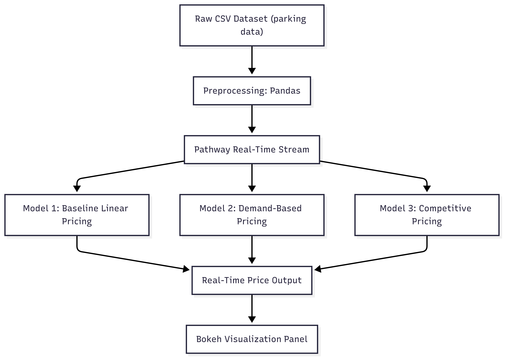

# Dynamic Pricing for Urban Parking Lots

## Overview
This project develops a real-time dynamic pricing engine for urban parking lots, aiming to **optimize revenue** and **improve parking efficiency** by adapting prices to fluctuating demand. It uses both **historical** and **real-time data**, incorporating factors such as:
- Occupancy
- Queue length
- Vehicle type
- Traffic conditions
- Special events

A **three-stage modeling approach** is applied to determine optimal dynamic prices.

---

## Architecture

---
##  Project Structure

| File Name              | Description                                                  |
|------------------------|--------------------------------------------------------------|
| `M1.ipynb`             | Baseline linear pricing model implementation.               |
| `M2.ipynb`             | Demand-based pricing with multi-factor demand calculation.  |
| `M3.ipynb`             | Competition-aware pricing model with geographic adjustments.|
| `dataset.csv`          | Historical parking lot dataset.                             |
| `architecture.png`     | Diagram of Architecture Used.                             |
| `parking_stream_m1.csv`| Simulated real-time data for Model 1.                       |
| `parking_stream_m2.csv`| Simulated real-time data for Model 2.                       |
| `parking_stream_m3.csv`| Simulated real-time data for Model 3.                       |
| `ppt.pdf`              | Project presentation and detailed methodology.              |
| `README.md`            | Project overview and usage instructions.                    |

---

## Dataset Features

- **Location**: Latitude and longitude of each lot (used for proximity/competition logic)
- **Capacity**: Total vehicle holding capacity
- **Occupancy**: Current number of parked vehicles
- **Queue Length**: Number of vehicles waiting to enter
- **Vehicle Type**: Car, bike, or truck (used for pricing weights)
- **Special Event Indicator**: Flags for holidays, public events, etc.
- **Traffic Conditions**: Local congestion levels
- **Timestamp**: Combined date and time of each observation

---

## Models

| Model | Description               | Key Features                                                                 |
|-------|---------------------------|------------------------------------------------------------------------------|
| M1    | Baseline Linear Model     | Price based on occupancy ratio. Simple, scalable, transparent.              |
| M2    | Demand-Based Pricing      | Uses multiple factors: occupancy, queue, traffic, events, vehicle type.     |
| M3    | Competition-Aware Pricing | Adjusts price based on nearby lot prices and proximity. Ensures fairness.   |

---

##  Tools & Technologies

- **Python** – Core programming language
- **Pandas**, **NumPy** – Data processing and manipulation
- **Pathway** – Real-time data stream processing
- **Bokeh** – Interactive pricing visualizations

---

##  How to Use

1. Open and run the Jupyter notebooks (`M1.ipynb`, `M2.ipynb`, `M3.ipynb`) to simulate each pricing strategy.
2. Use the corresponding stream files (`parking_stream_m1.csv`, etc.) to feed simulated real-time data.
3. Refer to `ppt.pdf` for full methodology, model equations, assumptions, and visual results.

